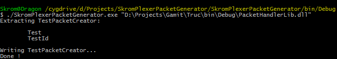

# Packet Handlers

To generate our PacketHandlers, we will use the [Generator tool](https://github.com/nvareille/SkromPlexerPacketGenerator)

---

In a Command line interpreter (Like Cygwin), let's execute the tool with our library as argument:



The tool will then generate the PacketHandler file for us !

# Known Issues
However if the tool is saying us there is an error, this is likely because:
- The path to you program / library is wrong
- You library requires references to some classes

---

# Solutions
### Wrong path
Please check the path to the library, go in windows explorer and directly copy the path to be sure it's correct

### More references required
Copy all you .dll you need for your project in the tool's folder (for example Debug/bin/).

The tool will load all libraries and resolve missing references so the extraction will be successful

---

# PacketHandler Output
Here is the raw file output:
```cs
public class TestPacketCreatorPacketHandler : APacketHandler
{
	public static List<Packet> Test(Core core, Client client, Packet packet)
	{
		return (null);
	}

	public static List<Packet> TestId(Core core, Client client, Packet packet)
	{
		PacketArg args = packet.GetArguments(new Type[]
		{
			typeof(int),
		});

		return (null);
	}


}
```

If the PacketCreator file was in the client, you can place this file in the server's project.

If the PacketCreator file was in the server, you can place this file in the client's project.

---

# Explaination of the PacketHandlers
The packetHandlers will treat the packets sent by both sides.

In a game for example, it is normal that a server will start a game session if a user sends a 'Start' Packet.

```cs
public class TestPacketCreatorPacketHandler : APacketHandler
{
	// This Method will be called if the other side sends a 'Test' Packet ("Test:\n")
	public static List<Packet> Test(Core core, Client client, Packet packet)
	{
		// Returning null means no direct answer
		return (null);
	}

	// This Method will be called if the other side sends a 'TestId' Packet ("TestId:1\n")
	public static List<Packet> TestId(Core core, Client client, Packet packet)
	{
		// We are getting arguments from that packet
		// This function will build the argument Matrix to be used later
		PacketArg args = packet.GetArguments(new Type[]
		{
			typeof(int),
		});

		// We retrive the first argument as int (The correct type)
		int it = args.Get<int>(0);

		// Direct answer from us, we return a list of Packets (Or convert a Packet to a list)
		// 'new Packet("Ok:\n") + new Packet("Thanks:\n")' adding Packets to create a list is possible too
		return (new Packet("Ok:\n").ToList());
	}


}
```

---

# [<< Packet Creator](PacketCreator.md) |